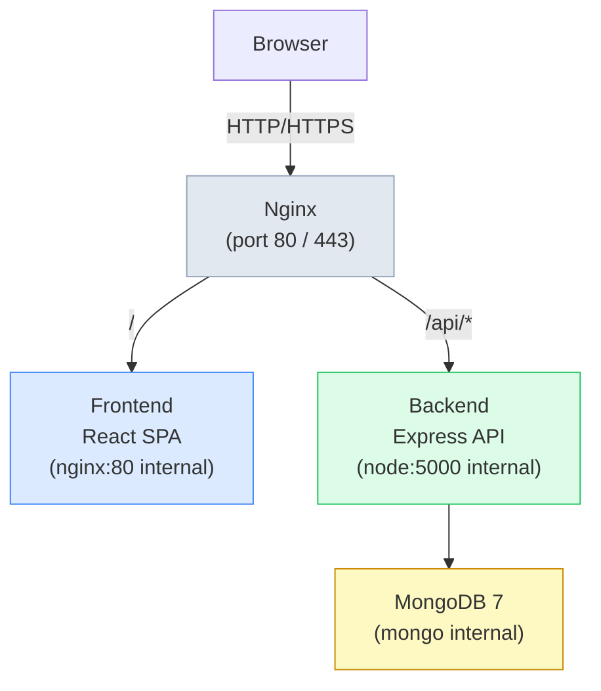

# Peta Ilmu Islam

A full-stack web application for navigating and managing Islamic knowledge roadmaps. The public site lets readers browse structured learning paths (_peta ilmu_) across classical Islamic disciplines. The admin panel allows privileged users to manage fields, books, contributors, and roadmap content.

---

## Table of Contents

- [Tech Stack](#tech-stack)
- [Architecture](#architecture)
- [Quick Start](#quick-start)
  - [Docker (recommended)](#docker-recommended)
  - [Local development](#local-development)
- [Environment Variables](#environment-variables)
- [Project Structure](#project-structure)
- [Scripts Reference](#scripts-reference)
- [Documentation](#documentation)
- [License](#license)

---

## Tech Stack

| Layer | Technology |
|---|---|
| Backend runtime | Node.js 20 + Express 5 |
| Backend database | MongoDB 7 (Mongoose 9) |
| Backend auth | JWT in httpOnly cookies |
| Frontend framework | React 19 + TypeScript 5 |
| Frontend build | Vite 7 |
| Frontend UI | Material UI v7 + Emotion |
| Frontend data | TanStack React Query v5 |
| Frontend routing | React Router v7 |
| Frontend forms | React Hook Form + Zod |
| Reverse proxy | Nginx 1.27 (Alpine) |
| Container | Docker + Docker Compose |

---

## Architecture



All four services run on an internal Docker bridge network (`app_net`). Only Nginx binds a host port (80/443). MongoDB is never exposed to the host.

---

## Quick Start

### Docker (recommended)

**Prerequisites:** Docker ≥ 24, Docker Compose v2.

1. Copy and fill in the root env file:

```bash
cp .env.example .env
# Edit .env — set strong values for MONGO_PASSWORD, JWT_SECRET, CORS_ORIGIN, VITE_API_URL
```

2. Start all services:

```bash
docker-compose up --build
```

3. Seed the first admin user (run once after the backend container is healthy):

```bash
docker-compose exec backend node src/seed/admin.seed.js
```

The application is reachable at `http://localhost` (Nginx). The admin panel is at `/admin`.

> **TODO:** `nginx/default.conf` (the reverse-proxy config) is not committed to the repository. You must create it before the stack works end-to-end. See [`docs/DEPLOYMENT.md`](docs/DEPLOYMENT.md) for the reference configuration.

---

### Local development

**Prerequisites:** Node.js 20, a running MongoDB instance (or `docker-compose up mongo`).

**Backend:**

```bash
cd backend
cp .env.example .env        # set MONGO_URI to your local instance
npm install
npm run dev                 # nodemon + DEBUG logging on port 5000
```

**Frontend:**

```bash
cd frontend
cp .env.example .env        # set VITE_API_URL=http://localhost:5000/api
npm install
npm run dev                 # Vite dev server on port 5173
```

---

## Environment Variables

### Root `.env` — used by Docker Compose only

| Variable | Description | Required |
|---|---|---|
| `MONGO_USER` | MongoDB root username | Yes |
| `MONGO_PASSWORD` | MongoDB root password | Yes |
| `MONGO_DB` | Database name | Yes |
| `JWT_SECRET` | JWT signing secret | Yes |
| `CORS_ORIGIN` | Allowed CORS origin(s) for the backend | Yes |
| `VITE_API_URL` | Public API base URL (baked into frontend build) | Yes |

### `backend/.env` — used for local development

See [`backend/README.md`](backend/README.md#environment-variables) for the full table.

### `frontend/.env` — used for local development

| Variable | Description | Required | Default |
|---|---|---|---|
| `VITE_API_URL` | Backend API base URL | No | `http://localhost:5000/api` |

---

## Project Structure

```
peta-ilmu-islam/
├── backend/                  # Express API
│   ├── src/
│   │   ├── controllers/      # Route handlers
│   │   ├── middleware/       # auth, async wrapper, error handler, role
│   │   ├── models/           # Mongoose schemas + Joi validators
│   │   ├── routes/           # Express routers
│   │   ├── seed/             # Admin seed script
│   │   ├── startup/          # DB connection, Winston logger
│   │   ├── app.js            # Express app factory
│   │   └── server.js         # Entry point
│   ├── tests/
│   │   ├── unit/             # Controller, middleware, model unit tests
│   │   └── integration/      # Supertest route integration tests
│   ├── logs/                 # Runtime log files (gitignored)
│   └── Dockerfile
├── frontend/                 # React SPA
│   ├── src/
│   │   ├── admin/            # Admin panel (features, layout, routes, services)
│   │   ├── app/              # Router + root layout
│   │   ├── components/       # Shared UI (Navbar, Logo, etc.)
│   │   ├── data/             # Static JSON (books, roadmaps, fields)
│   │   ├── features/         # Public-site feature components
│   │   ├── hooks/            # React Query hooks
│   │   ├── pages/            # Top-level page components
│   │   ├── sections/         # Page sections (hero, footer, about…)
│   │   ├── services/         # Axios API functions
│   │   ├── theme/            # MUI theme + color mode context
│   │   └── types/            # Shared TypeScript types
│   ├── nginx.conf            # Nginx config for the static container
│   └── Dockerfile
├── docs/
│   ├── ARCHITECTURE.md
│   ├── CONTRIBUTING.md
│   └── DEPLOYMENT.md
├── docker-compose.yml
└── .env.example              # Root env template for Docker Compose
```

---

## Scripts Reference

### Backend (`cd backend`)

| Command | Description |
|---|---|
| `npm run dev` | Start with nodemon + `DEBUG=app:*,db:*` |
| `npm start` | Production start (`node src/server.js`) |
| `npm test` | Run unit tests in watch mode |
| `npm run test:unit` | Unit tests, single run |
| `npm run test:integration` | Integration tests (requires MongoDB Memory Server) |
| `npm run test:all` | All tests, single run |
| `node src/seed/admin.seed.js` | Seed the first admin user |

### Frontend (`cd frontend`)

| Command | Description |
|---|---|
| `npm run dev` | Vite dev server on port 5173 (`--host`) |
| `npm run build` | TypeScript check + production build |
| `npm run lint` | ESLint |
| `npm run preview` | Serve the production build locally |

---

## Documentation

| Document | Contents |
|---|---|
| [`backend/README.md`](backend/README.md) | API reference, data models, testing, seeding |
| [`frontend/README.md`](frontend/README.md) | Component architecture, routing, theming |
| [`docs/ARCHITECTURE.md`](docs/ARCHITECTURE.md) | System design, request lifecycle, data flow |
| [`docs/CONTRIBUTING.md`](docs/CONTRIBUTING.md) | Branching, commits, PR checklist, adding features |
| [`docs/DEPLOYMENT.md`](docs/DEPLOYMENT.md) | Docker walkthrough, Nginx config, production hardening |

---

## License

> **TODO:** Add a license. If this is open-source, consider MIT or GPL-3.0. Add a `LICENSE` file at the repository root and update this section.
