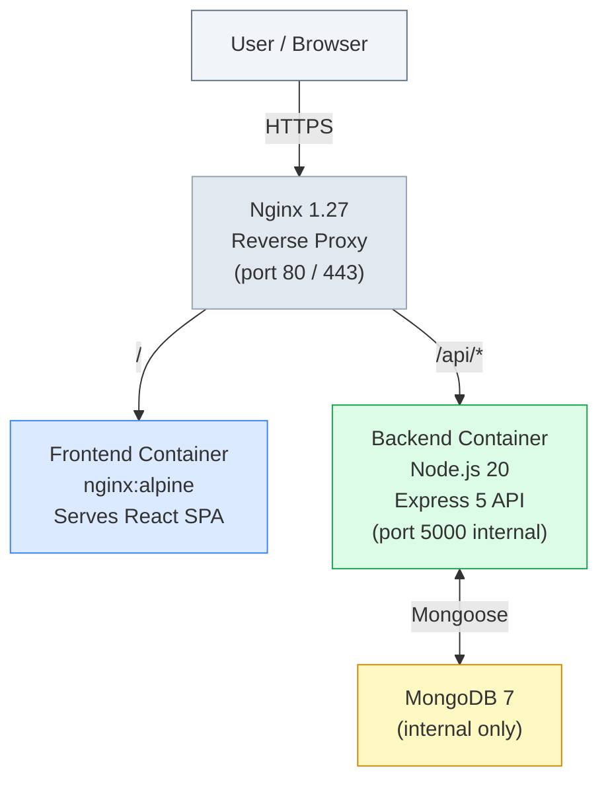
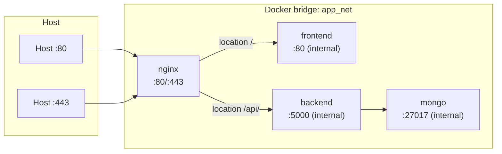
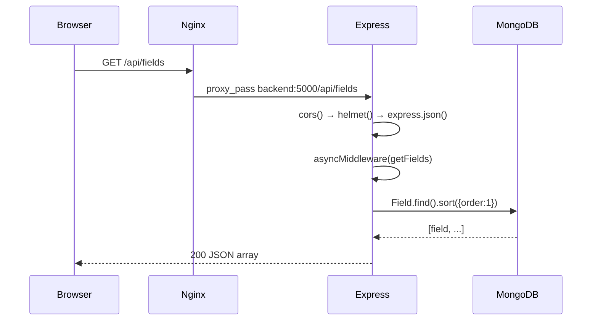
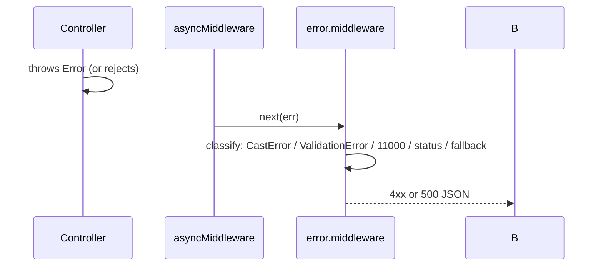
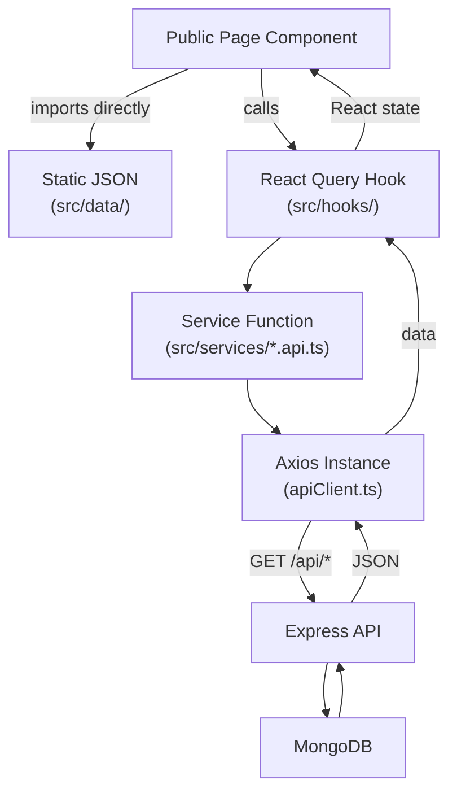
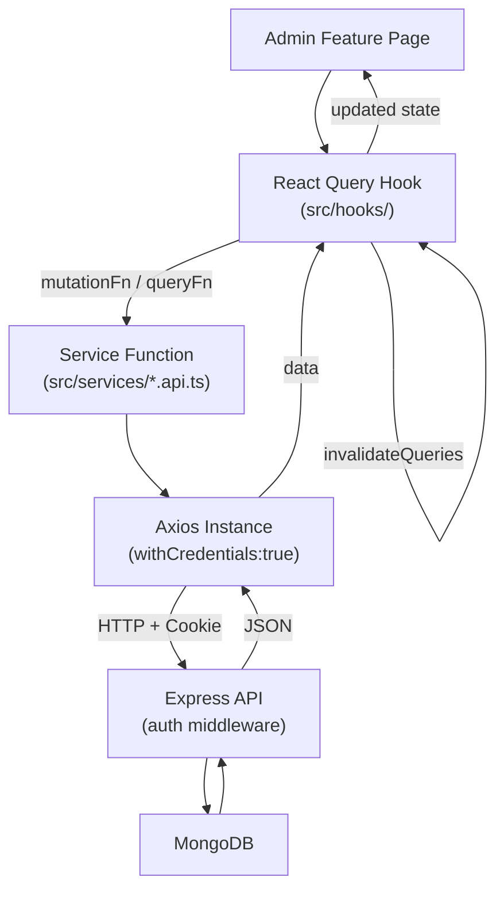
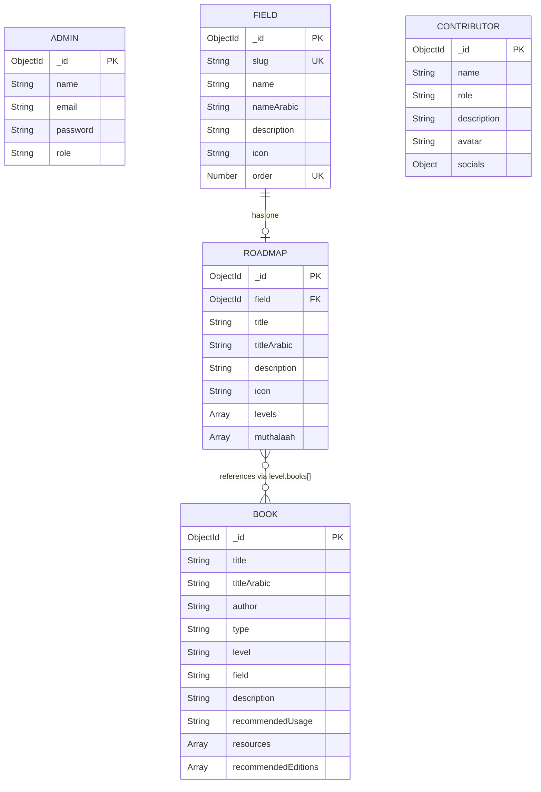
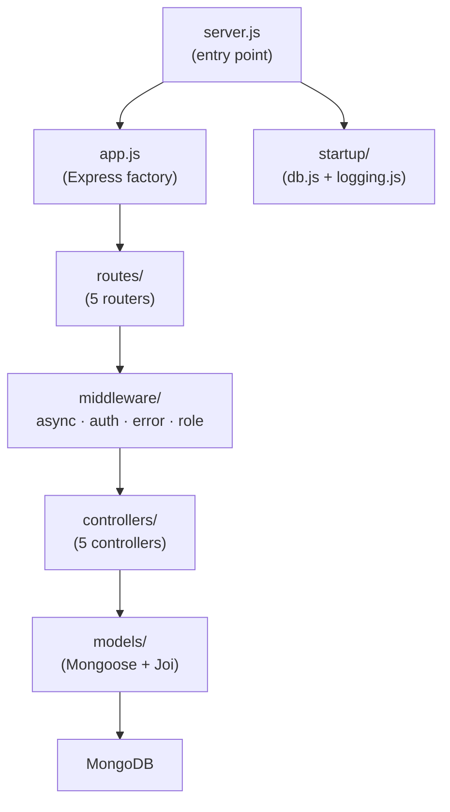
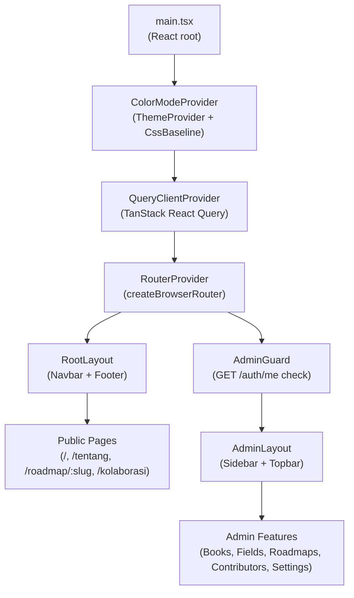

# Architecture — Peta Ilmu Islam

This document describes the high-level system design, request lifecycle, data flow, and deployment topology of the Peta Ilmu Islam application.

---

## Table of Contents

- [System Overview](#system-overview)
- [Service Topology](#service-topology)
- [Request Lifecycle](#request-lifecycle)
- [Authentication Flow](#authentication-flow)
- [Data Flow: Frontend ↔ Backend ↔ MongoDB](#data-flow-frontend--backend--mongodb)
- [Data Model Relationships (ER Diagram)](#data-model-relationships-er-diagram)
- [Backend Internal Architecture](#backend-internal-architecture)
- [Frontend Internal Architecture](#frontend-internal-architecture)

---

## System Overview



Four services run on an internal Docker bridge network (`app_net`):

| Service | Image | Exposed externally | Role |
|---|---|---|---|
| `nginx` | `nginx:1.27-alpine` | 80, 443 | Reverse proxy; routes `/api/*` to backend, everything else to frontend |
| `frontend` | Custom (`node:20-alpine` → `nginx:1.27-alpine`) | No | Serves the Vite-built static bundle |
| `backend` | Custom (`node:20-alpine`) | No | Express REST API |
| `mongo` | `mongo:7` | No | Database |

---

## Service Topology



MongoDB is never reachable from the host — only the backend container can connect to it over `app_net`. All traffic from users enters through the single Nginx port.

---

## Request Lifecycle

### Public API request (unauthenticated)



### Protected mutation (authenticated)

```mermaid
sequenceDiagram
    participant B as Browser
    participant N as Nginx
    participant E as Express
    participant AM as authMiddleware
    participant C as Controller
    participant DB as MongoDB

    B->>N: POST /api/books (Cookie: token=<jwt>)
    N->>E: proxy_pass backend:5000/api/books
    E->>AM: verify JWT from cookie
    AM->>AM: jwt.verify(token, JWT_SECRET)
    AM->>C: req.admin = {id, role}; next()
    C->>C: Joi validate(req.body)
    C->>DB: Book.findOne({title}) — duplicate check
    C->>DB: new Book(req.body).save()
    DB-->>C: saved book
    C-->>B: 201 book object
```

### Error propagation



---

## Authentication Flow

Authentication is cookie-based. No `Authorization` header is used.

```mermaid
sequenceDiagram
    participant B as Browser
    participant API as Backend /api/auth
    participant DB as MongoDB

    Note over B,DB: Login
    B->>API: POST /auth/login {email, password}
    API->>DB: Admin.findOne({email})
    DB-->>API: admin doc (with hashed password)
    API->>API: bcrypt.compare(password, hash)
    API->>API: jwt.sign({id, role}, JWT_SECRET, {expiresIn:"1d"})
    API-->>B: 200 + Set-Cookie: token=<jwt>; HttpOnly; SameSite=Strict; Secure(prod)

    Note over B,DB: Subsequent protected requests
    B->>API: GET /auth/me (Cookie: token=<jwt> sent automatically)
    API->>API: jwt.verify(token, JWT_SECRET) → {id, role}
    API->>DB: Admin.findById(id).select("-password")
    DB-->>API: admin doc
    API-->>B: 200 admin object

    Note over B,DB: Logout
    B->>API: POST /auth/logout
    API-->>B: 200 + Set-Cookie: token=; Max-Age=0 (clears cookie)
```

Cookie attributes:
- `httpOnly: true` — inaccessible to JavaScript; protects against XSS token theft.
- `secure: true` — only transmitted over HTTPS (production only).
- `sameSite: "strict"` — not sent on cross-site navigations; protects against CSRF.
- `maxAge: 24h` — matches JWT expiry.

---

## Data Flow: Frontend ↔ Backend ↔ MongoDB

### Public site data flow



### Admin data flow



---

## Data Model Relationships (ER Diagram)



Notes:
- `BOOK.field` is a plain string (denormalized discipline name), not a reference to `FIELD._id`.
- `ROADMAP.levels[].books[]` and `ROADMAP.muthalaah[].books[]` are arrays of ObjectId refs to `BOOK`.
- `ADMIN` is standalone — no relations to other collections.

---

## Backend Internal Architecture



### Middleware execution order (per request)

1. `helmet()` — security headers
2. `cors()` — CORS headers + preflight
3. `express.json({ limit: "10kb" })` — body parsing
4. `cookieParser()` — cookie parsing
5. `loginLimiter` (rate limiter, only on `/api/auth/login`, disabled in test)
6. Route-level: `authMiddleware` (protected routes only)
7. Route-level: `asyncMiddleware(controller)` — wraps handler, forwards errors
8. `error.middleware` (global) — normalizes and serializes errors

---

## Frontend Internal Architecture


