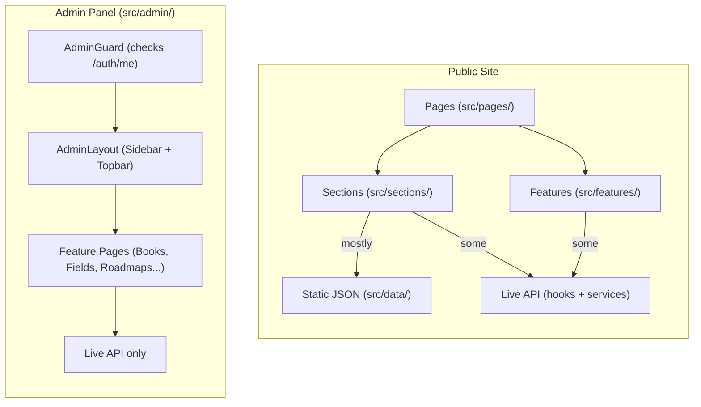
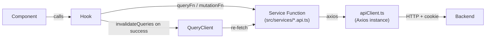

# Frontend — Peta Ilmu Islam

React 19 + TypeScript SPA. Vite dev server on port **5173**.

---

## Table of Contents

- [Architecture Overview](#architecture-overview)
- [Tech Stack](#tech-stack)
- [Folder Conventions](#folder-conventions)
- [Routing Map](#routing-map)
- [State & Data Fetching](#state--data-fetching)
- [Theming & Color Mode](#theming--color-mode)
- [Scripts](#scripts)
- [Environment Variables](#environment-variables)

---

## Architecture Overview

The frontend has two distinct areas with different data sources:



**Public site** — Pages consume a mix of static JSON files from `src/data/` (most content) and live API calls via React Query hooks (e.g., `LearningCategories` in the footer fetches live fields). Static JSON is the primary source for roadmap display.

**Admin panel** — All data comes from the live API. Protected by `AdminGuard`, which calls `GET /auth/me` on mount and redirects to `/admin/login` on a 401.

---

## Tech Stack

| Concern | Library | Version |
|---|---|---|
| UI framework | React | 19 |
| Language | TypeScript | ~5.9 |
| Build tool | Vite | 7 |
| Component library | Material UI (`@mui/material`) | 7 |
| Data grid | `@mui/x-data-grid` | 8 |
| Icons | `@mui/icons-material` | 7 |
| Styling engine | Emotion | 11 |
| Server state | TanStack React Query | 5 |
| HTTP client | Axios | 1 |
| Routing | React Router DOM | 7 |
| Forms | React Hook Form | 7 |
| Schema validation | Zod | 4 |
| Icon set | react-icons | 5 |

---

## Folder Conventions

```
src/
├── admin/                        # Admin panel (protected area)
│   ├── components/               # Sidebar, Topbar, StatCard
│   ├── features/                 # Per-resource feature modules
│   │   ├── books/
│   │   │   ├── BooksPage.tsx     # Page component — wires hooks to UI
│   │   │   ├── BooksTable.tsx    # MUI DataGrid
│   │   │   ├── BookDialog.tsx    # Create/edit modal (detects mode via initialData)
│   │   │   ├── book.schema.ts    # Zod schema
│   │   │   └── books.types.ts    # TypeScript interfaces
│   │   ├── contributors/         # Same structure
│   │   ├── fields/               # Same structure
│   │   ├── roadmaps/             # Roadmap editor (SectionCard, LevelCard, AddBookDialog)
│   │   ├── dashboard/            # Stats + recent-items tables
│   │   └── settings/
│   ├── layout/                   # AdminLayout.tsx (Sidebar + Topbar + Outlet)
│   ├── pages/                    # Thin page wrappers that delegate to features/
│   ├── routes/                   # AdminGuard.tsx
│   ├── routes.tsx                # Admin route tree
│   └── services/                 # Axios instance used inside admin
├── app/
│   ├── layout.tsx                # RootLayout (Navbar + Footer + Outlet)
│   └── router.tsx                # createBrowserRouter — public + admin routes
├── components/                   # Shared components (Navbar, Logo, ColorModeSwitch)
├── data/                         # Static JSON (books/, fields/, roadmaps/)
├── features/                     # Public-site feature components
│   ├── books/                    # BookDetail.tsx
│   ├── fields/                   # FieldCard, FieldList
│   └── roadmaps/                 # Roadmap, RoadmapLevel, KitabDarsCard, etc.
├── hooks/                        # React Query hooks (useBooks, useFields, useRoadmap...)
├── pages/                        # Top-level page components (HomePage, AboutPage...)
├── sections/                     # Page sections rendered inside pages
│   ├── about/
│   ├── collaborators/
│   ├── footer/
│   ├── hero/
│   └── learning-approach/
├── services/                     # Axios API call functions
│   ├── apiClient.ts              # Shared Axios instance (baseURL from VITE_API_URL)
│   ├── books.api.ts
│   ├── contributors.api.ts
│   ├── fields.api.ts
│   └── roadmaps.api.ts
├── theme/                        # MUI theme + color mode provider/context
└── types/                        # Shared TypeScript types (book.ts)
```

### Admin feature module pattern

Each admin feature follows this consistent structure:

| File | Role |
|---|---|
| `<Feature>Page.tsx` | Page component — composes table, dialog, and header |
| `<Feature>Table.tsx` | MUI DataGrid with column definitions and row actions |
| `<Feature>Dialog.tsx` | Create/edit modal (react-hook-form + Zod); detects mode from presence of `initialData` prop; calls `reset()` in `useEffect` when `initialData` changes |
| `<feature>.schema.ts` | Zod schema for form validation |
| `<feature>.types.ts` | TypeScript interfaces for the resource |

---

## Routing Map

Routing is defined in `src/app/router.tsx` via `createBrowserRouter`.

> `src/App.tsx` is stale and unused — do not edit it.

### Public routes

Wrapped in `RootLayout` (Navbar + Footer + `<Outlet />`):

| Path | Component | Description |
|---|---|---|
| `/` | `HomePage` | Landing page (hero, learning categories, etc.) |
| `/tentang` | `AboutPage` | About the project |
| `/roadmap/:slug` | `Roadmap` | Roadmap detail for the given field slug |
| `/kolaborasi` | `CollaboratorsPage` | Contributors / collaborators listing |

### Admin routes

Nested under `/admin`:

```
/admin
├── login                    LoginPage (no guard)
└── (AdminGuard)             calls GET /auth/me; redirects to /admin/login if unauthenticated
    └── (AdminLayout)        Sidebar + Topbar shell
        ├── (index)          DashboardPage
        ├── books            BooksPage
        ├── roadmaps         RoadmapsPage
        ├── fields           FieldsPage
        ├── contributors     ContributorsPage
        └── settings         SettingsPage
```

**`AdminGuard`** (`src/admin/routes/AdminGuard.tsx`) — on mount, calls `GET /auth/me`. Shows a centered spinner while the request is in-flight. Renders `<Outlet />` on success; issues `<Navigate to="/admin/login" replace />` on failure.

---

## State & Data Fetching



**Rule:** Components never import `axios` or call `fetch` directly. All network access goes through a service function and a React Query hook.

### Query keys

| Resource | Query key |
|---|---|
| All books | `["books"]` |
| All fields | `["fields"]` |
| All contributors | `["contributors"]` |
| Roadmap by field | `["roadmap", fieldSlug]` |
| All roadmaps | `["roadmaps"]` |

### Mutation pattern

Every mutation calls `queryClient.invalidateQueries` in `onSuccess`:

```ts
return useMutation({
  mutationFn: createField,
  onSuccess: () => {
    queryClient.invalidateQueries({ queryKey: ["fields"] });
  },
});
```

### API client

`src/services/apiClient.ts`:

```ts
const api = axios.create({
  baseURL: import.meta.env.VITE_API_URL ?? "http://localhost:5000/api",
  withCredentials: true,  // sends the httpOnly token cookie automatically
});
```

> **TODO:** `src/admin/services/api.ts` is a duplicate Axios instance with the same configuration. Consolidate to a single import from `src/services/apiClient.ts`.

---

## Theming & Color Mode

The application defaults to **dark mode**. Users toggle it via `ColorModeSwitch`.

### Files

| File | Role |
|---|---|
| `src/theme/ColorModeContext.ts` | React context — holds `{ toggleColorMode }` |
| `src/theme/ColorModeProvider.tsx` | Stateful provider — manages `mode` state, wraps MUI `ThemeProvider` + `CssBaseline` |
| `src/theme/useColorMode.ts` | Convenience hook: `useContext(ColorModeContext)` |
| `src/theme/theme.ts` | `getTheme(mode)` — returns a full MUI theme for the given mode |
| `src/components/ColorModeSwitch.tsx` | Toggle button wired to `useColorMode()` |
| `src/theme/mui.d.ts` | TypeScript module augmentation for custom palette tokens |

### Custom palette tokens

`getTheme` extends the MUI palette with project-specific tokens:

| Token | Value | Usage |
|---|---|---|
| `teal.100` | `#1a746b` | Accent teal |
| `teal.200` | `#145e57` | Darker teal |
| `teal.300` | `#0f4a45` | Darkest teal |
| `level.beginner` | `#22c55e` | Beginner-level label |
| `level.intermediate` | `#3b82f6` | Intermediate-level label |
| `level.advanced` | `#a855f7` | Advanced-level label |
| `glassBackground` | `rgba(255,255,255,0.5)` (light) / `rgba(0,0,0,0.5)` (dark) | Glassmorphism cards |
| `primary.main` | `#0f766e` (light) / `#2dd4bf` (dark) | Primary action color |
| `background.default` | `#f8fafc` (light) / `#0b0f0e` (dark) | Page background |
| `background.paper` | `#ffffff` (light) / `#111716` (dark) | Card / surface |

---

## Scripts

Run from the `frontend/` directory.

| Command | Description |
|---|---|
| `npm run dev` | Vite dev server on port 5173, bound to all interfaces (`--host`) |
| `npm run build` | TypeScript type-check (`tsc -b`) then Vite production build to `dist/` |
| `npm run lint` | ESLint across all source files |
| `npm run preview` | Serve the `dist/` build locally for smoke-testing |

---

## Environment Variables

All Vite env vars must be prefixed `VITE_` to be accessible in browser code.

| Variable | Description | Required | Default |
|---|---|---|---|
| `VITE_API_URL` | Backend API base URL | No | `http://localhost:5000/api` |

> `VITE_API_URL` is **baked into the bundle at build time**. In the Docker Compose stack it is passed as a build argument (`ARG VITE_API_URL`). Changing it after a build requires a full rebuild.
